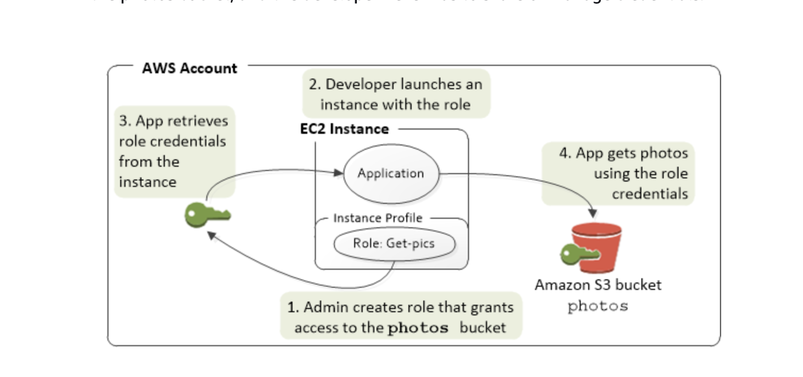

# IAM ( Identity and Access Management )

## Principal
Principal is a person or some service that has permissions to access some kind of resource.  

## AWS roles
AWS roles have many usecases and they are simillar to actual user entities of aws IAM. One of the most important and interesting usecases is if
we want our specific service to access and talk to some other resource/service in aws. Best example is when we write an app that we run on ec2 instance and which needs to access
s3 bucket's resource. One of the most basic solutions for this problem that comes to mind is to have s3 publicly available and also have ec2 instance either in public subnet or
have it in a private subnet and using NAT in public subnet communicate via internet gateway to public internet resources. But let's all agree that this case is greately
simplified and there can be most usecases where we want program on private ec2 instance to communicate with other aws resource like s3.
For this last specific case the solution is to create IAM roles which will have security policies specialized to their needs ( like onlyAccessReadS3, or ReadAndWriteAccessS3 and etc. ).
After creating this role from IAM dashboard from console or via CLI we then associate already running ec2 instance from ec2 instance dashboard menu with this newly created IAM role ( from 
security configuration ). After this process, ec2 instance and all the programs running there will have explicit permission to access other AWS resources ( in this specific case s3 bucket ) 

## Idea
The main idea before mechanism of roles for accessing different aws services ( like ec --> s3 ) is that all requests, no matter from inside of vpc or outside of vpc to AWS services must
be cryptograhpically signed. ( Like if you want to write an app, like aws s3 wrapper, which using http requests of get and post to your app endpoints modifies s3 bucket. For this to work on
local or any machine your app has to use acces key on your local machine, which by default is located in your systems folder hirearchy if you have used aws cli even once). Just since it's not awlays
safe and easy to use mechanism to have access key permanent on your machine roles ( maybe profiels ) ease this process of granting temporary keys by which app can acces aws services and which will
automatically time out and they won't be persisted in storage on some machine which can be hacked. 

### Profiles
On a code  and implementaiton level it's interesting how to manage and get all the security/role config. necessary to access role assumed aws services.

## Diagram of using roles from ec2 to s3

## IAM Identities
IAM identities are entities from next group: user,user-group,role).
They are all the needed definitions of service users that needs to be managed for aws cloud to be secure.
- IAM users: IAM users are entities in aws cloud which you can assign to physical users to enable them to access limitied cloud funcitonality. ( these limits are set by the admin user ).
This access for IAM user can be: console sign-in, programattic api request and etc. You can add user to some usergroup with some permissions or directly attach policies to it.
- IAM user-groups: collection of IAM-users, using user-groups it's much easier to manage team that has different permissions to access the cloud functionalities.
A user group can't be identified as a "Principal" in a resource based policy. 
- IAM roles: roles are pretty much same as users, same identities. but with one big difference from users that roles don't have credentials. Instead of beeing exclusively associated with one physical
person role is assumed to be used by anyone who needs to use it. Roles are mostly used for aws services that need to access other aws services and not for physical users who want to use aws.  

## IAM Policies
Policies are rules that you attach to IAM identities( user-groups, users, roles ). There are 6 types of policies:
- Identity based policy: attached to users,user-groups and roles to control their permissions for resources. Further there are 2 types of identity polciies: managed and inline. 
managed policies are explicityl created separate, reusable entities which also might be created by AWS or some person. inline policies aren't reusable. 
- resource based policy: resource based policies are access rules that you attach directly to a resource needed to be used, and restrict or allow which principals can access it. If resource and principal
are in the same account, only specifiying principal access in resource based policy is enough and no explicit IAM identity is needed to access resource, but if principal and resource are in different
accoutns than explicit identity policy is also needed. You can specify as user: iam id, aws lambda resource name and etc. 
- permissions boundaries:
- organizations SCP:
- ACL:
- session policies:
