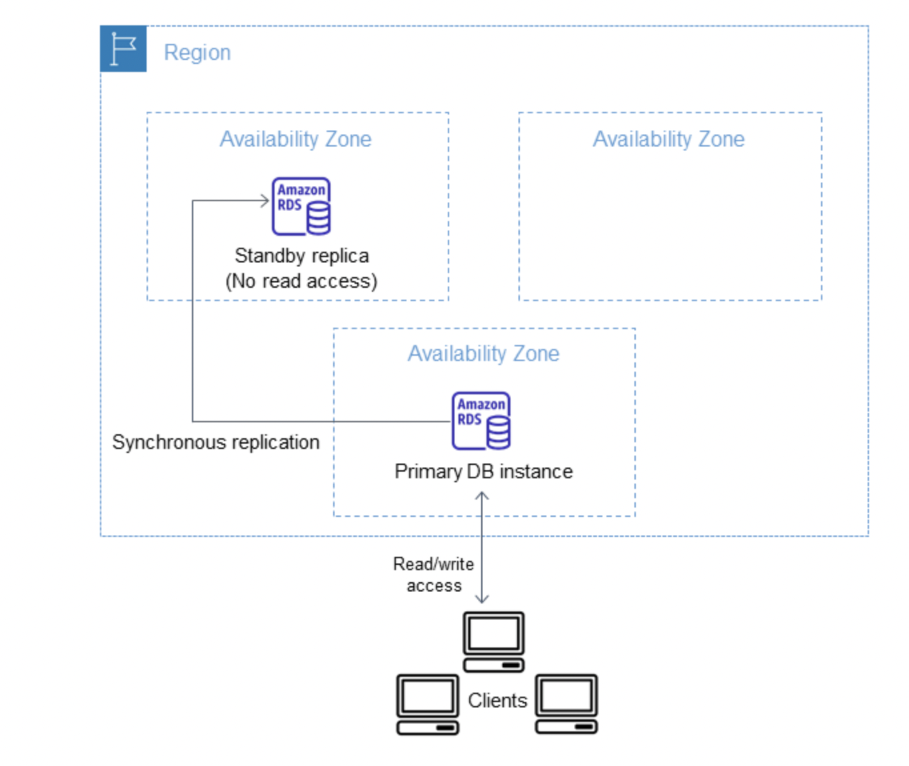
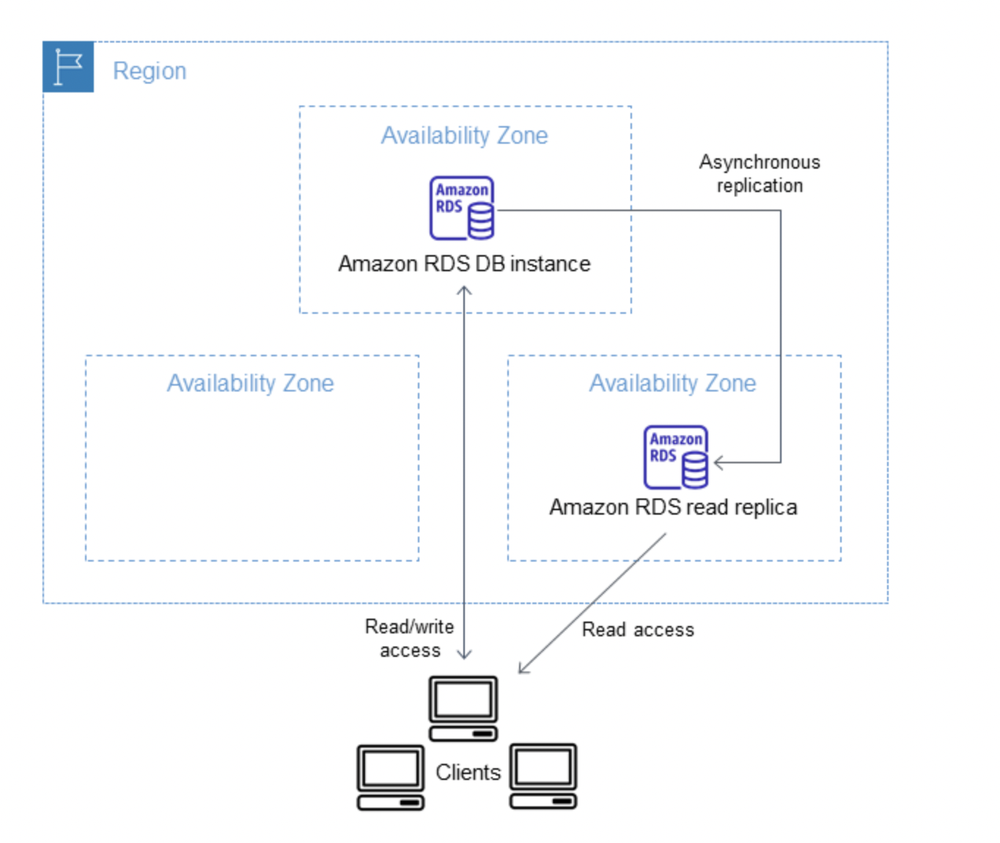

# AWS Relation Database Service
aws RDS is a highly available and fault toleerant database service provided by amazon. This is PAAS model, since it allows you to choose software like
umplementation of database: postgres, mysql and etc. yourself but the managmenet of the chosen software, platform, OS and infrastructure is fully on AWS side.

AWS RDS provides two main mechanisms for scalability and failover/high-availability.

## Failover/high-availability
Multi-AZ DB instance deployments are mechanisms that provide aws RDS instances high availability.
This mechanism for RDS is active passive pattern for high availability. You create 1 primary and 1 seconday instances, each write on primary
database synchronously patches seconday database too, so data on both of db-s are exactly the same always, so at any point in time, if primary database fails you can without any problem 
fail over to seconday database. Mutli AZ deployemnt is not a solution for scaling the performance of the RDS database since it is active passive pattern. 
This mechanisms might have relatively slow IO compared to single AZ deployments since each write must also replicate data in different AZ.

#### Using multi az deploymnet
If you wont to create multi AZ deployment for RDS you can specify it during the creation process.
If you want to create Multi AZ RDS instances for already created single AZ deployment aws takes several steps:
1) Takes a snapshot of already existing instance
2) Creates new instance with this snapshot in separate AZ
3) Setups synchronous synchronization between original and new instnaces.

## To scale the performance of RDS read replicas could be used  
Most of the databases like Postgres, supports creating read replicas which will serve as passive instances and which will serve users routed to them.
The main idea is that all the writes are routed to the primary instnace, and all of these updates are propagated from write instance to all read replicas asynchronosuly.
When client wants to read data, we distribute routes according to some algorithm to different read replicas, which will allow us to scale our system.

#### Usage
When you want to create a read replica you specify original instance, AWS takes a snapshot of that instance and creates a new read only replica out of this snapshot.
After this setup aws uses async replication method to synchronize primary and read replicas.
