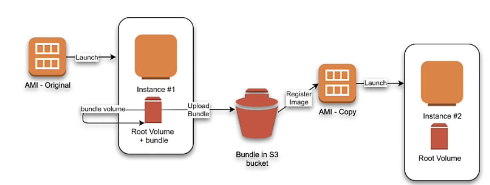

# Amazon machine images
You MUST launch anu ec2 instance from some AMI, so it is  must prerequisite for launching ec2. 
AMI is serialized configuration of ec2 instance, you can instantiate many instances of ec2 with same AMI when you need several ec2 instances with the same
configuration. 

AMI includes:
- One or more Elastic block store snapshots. or for instance-store-backed AMI-s a template for the root volume of the instnace.( which means which storage option to use ) 
- Launch permissions that control which aws accounts can use AMI to run ec2 instances.
- Block device mapping that specifies volumes to attach to instance when it starts up.

## Using AMI
Next diagram summarizes AMI lifecycle, You can create then register AMI and you are ready to launch new instances with it.
You can copy AMI within the same or different Region. When you don't need AMI no more you can deregister AMI.
When you create an ami ebs snapshot or template is created and then we register that ami and only after that launch them.

## Creating AMI-s
You can create AMI in two different ways: EBS stored AMI or instnace stored AMi.
For both mechanisms idea is next:
Launch an instance from an existing AMI ---> Customize instnace ( install webserver, other apps ) ---> save the updates configuration as  custom AMI
using this mechanism instnaces launched from the newly created AMI contain all updates and customization applied to image.

The root device of an instance determines the actual creation process of AMI
- Root volume of an instance is either instance-store or EBS.

- Launching using EBS: AMI #1 is first ami that is used to launch first ec2 instance (#1). Instance #1 has elastic block store associated with it.
You customize instnace and create an AMI #2 from instance#1 which contains all the updates and we can now use ami #2 to launch new instances.
Amazon EBS-backed AMI – The root device for an instance launched from the AMI is an Amazon Elastic Block Store (Amazon EBS) volume created from an Amazon EBS snapshot.

When you want to create AMI from running ec2 instance, Amazon ec2 powers down instance to guarantee everything is in a consistent state. AWS ec2 than creates
a snapshot for ec2 ebs volume. and later whenever we start up a new instance from this AMI this specific snapshot will be used as a baseline of root storage.

- Launching using instance-store: Main idea here is basically same as in EBS step( previous one ) just since instance-store doesn't have snapshot mechanism like
EBS  we must by hand bundle it up and It takes several minutes for the bundling process to complete. After the process completes, you have a bundle, which consists of an image manifest (image.manifest.xml) and files (image.part.xx) that contain a template for the root volume. Next you upload the bundle to your Amazon S3 bucket and then register your AMI.  and then use s3 stored ami to create new instances.
When you launch an instance using the new AMI, we create the root volume for the instance using the bundle that you uploaded to Amazon S3. The storage space used by the bundle in Amazon S3 incurs charges to your account until you delete it. For more information, see Deregister your Linux AMI.
Amazon instance store-backed AMI – The root device for an instance launched from the AMI is an instance store volume created from a template stored in Amazon S3.

## final
Basically EBS backed AMI creation is easier process since it automatically uses ebs snapshot to capture the state of instnace ( with softwarem file system and etc on it). With instance-store AMI creation you must explicitly bundle your ami and put it on s3 bucekt and later use it from s3 bucket.
