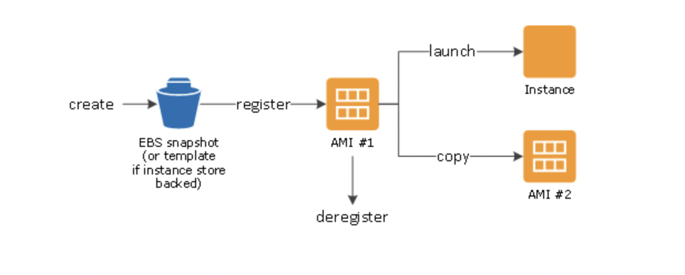
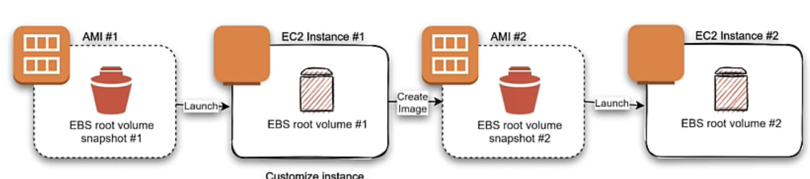

# Amazon machine images
You MUST launch anu ec2 instance from some AMI, so it is  must prerequisite for launching ec2. 
AMI is serialized configuration of ec2 instance, you can instantiate many instances of ec2 with same AMI when you need several ec2 instances with the same
configuration. 

AMI includes:
- One or more Elastic block store snapshots. or for instance-store-backed AMI-s a template for the root volume of the instnace.  
- Launch permissions that control which aws accounts can use AMI to run ec2 instances.
- Block device mapping that specifies volumes to attach to instance when it starts up.

## Using AMI
Next diagram summarizes AMI lifecycle, You can create then register AMI and you are ready to launch new instances with it.
You can copy AMI within the same or different Region. When you don't need AMI no more you can deregister AMI.
When you create an ami ebs snapshot or template is created and then we register that ami and only after that launch them.

## Creating AMI-s
You can create AMI in two different ways: EBS stored AMI or instnace stored AMi.
For both mechanisms idea is next:
Launch an instance from an existing AMI ---> Customize instnace ( install webserver, other apps ) ---> save the updates configuration as  custom AMI
using this mechanism instnaces launched from the newly created AMI contain all updates and customization applied to image.

The root device of an instance determines the actual creation process of AMI
- Root volume of an instance is either instance-store or EBS.

- Launching using EBS: AMI #1 is first ami that is used to launch first ec2 instance (#1). Instance #1 has elastic block store associated with it.
You customize instnace and create an AMI #2 from instance#1 which contains all the updates and we can now use ami #2 to launch new instances.
We dont upload created AMI during ebs stored volume anywhere since EBS itself is persistent storage, and we'll in this case pay for storing cost in EBS.

- Launching using instance-store: Main idea here is basically same as in EBS step( previous one ) just since instance-store isnot a persistent storage we
must after creating AMI from customized ec2 instance store it somewhere safe and this storage can be S3 ofcourse. and then use s3 stored ami to create new instances.

