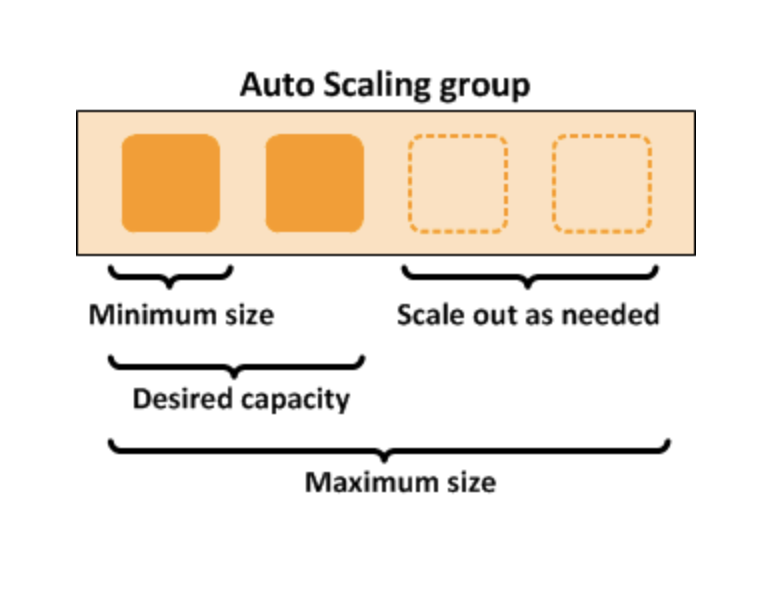

# Auto scaling
EC2 instance auto scaling mechanims in AWS assures you that at any point in time your application's scale is in accordance to
the traffic and load in that specific point in time.
What auto scalling lets users do is to update number of ec2 instances and the scale of the system dynamically without making any
straight ahead locked in decisions. This mechanism saves a lot of money and a lot of infrastructure provisioning overhead.  

In AWS Autoscalling groups you can specify min and max number of instances and depending on traffic number of ec2 instances will fluctuate
between these 2.

## Inner workings of Auto scalling
There are 2 main steps to make auto scalling up and working:
- Create a launch configuraiton. Select AMI, Add customization via User Data, Add Storage, apply security group.
- Create an autoscalling group, define group size, setup network and subnet, add load balancer. 

Scaling policies are mechanisms that decide to scale up or down current instances in instance autoscalling group
Very interesting and useful mechanisms are 1) manual, 2) shceduled, 3)on demand ( reacting to memory, network, cpu updates) scaling of auto scalling group 

You can have several policies wrapped up together among the auto scalling group.
Scale of your group will dynamically fluctuate depending on whether usage and stress of your app increases or decreases.

## Auto scaling components
These are the key components of autoscalling:
- Groups: Groups are logical grouping of ec2 instances that follow uniform laws. You can specify min,max and desired number of ec2 instnaces in a group.
- Configuration templates: you can use launch templates or configuration templates to specify what specifics/properties should ec2 instances in auto scalling group havei. You can specify information such as the AMI ID, instance type, key pair, security groups, and block device mapping for your instances. 

- Scaling options: Amazon EC2 Auto Scaling provides several ways for you to scale your Auto Scaling groups. For example, you can configure a group to scale based on the occurrence of specified conditions (dynamic scaling) or on a schedule 

## Pricing
There are no additional fees with Amazon EC2 Auto Scaling, so it's easy to try it out and see how it can benefit your AWS architecture. You only pay for the AWS resources (for example, EC2 instances, EBS volumes, and CloudWatch alarms) that you use.

## Auto scalling options
- Maintain current instance levels at all the time
- Scale manually
- Scale based on a schedule
- Scale based on demand/ dynamic scaling
	- Target tracking scaling	
- Use predictive scaling

## Auto scalling benefits
- EC2 autoscalling group can detect if any instance becomes unhleathy and can replace it without any manual intervention needed. 
- Better availability, since you can configure ec2 instances for auto scalling group in several different AZ-s.
- Beetter cost management, since auto scalling group mechanism automatically scales down whenever needed, cost management is always optimized.

## Distributing instances across multiple AZ-s
As we probably know aws services in the context of geolocation consist of regions and each region consists of multiple availability zones.
These AZ-s are engineered to be isolated from one another and to function independently of one another.
AWS auto scalling allows users to benefit from multi AZ deployment. You can sping up auto scalling groups in several different AZ-s in a region.
When one AZ becomes unhealthy auto scalling group notices it and spins up new instances in healthy AZ-s so that total number of ec2 instances
stays stable. Later when all used AZ-s come bacl to normal, auto scalling group automatically redistributes ec2 instances between them.

An Auto Scaling group can contain EC2 instances in one or more Availability Zones within the same Region. However, Auto Scaling groups cannot span multiple Regions.

1 auto scalling group has one to many relationship between subnets/avaliablity zones. So 1 auto sacling group can have many subnets associated with it.
As stated before auto scalling group can span multiple AZ-s but it must strictly be in one region, it can't span multiple regions.
AWS auto scalling always tries to distribute ec2 instnaces between availabiltiy zones uniformly but if because of some reason it is not possible resources will be always used at their best.

## Creation of auto scalling group
When you want to create auto scalling group first you must create configuration template. After it you can start creating auto scalling group using this template.
One of the most important topics here is if ELB should be used to distribute your traffic betweem ec2 instances. In the majority of cases you should use ELB,
and one important detail is that you should always match availability zones you choose for your auto scalling groups with the availiablity zones that your ELB uses.
