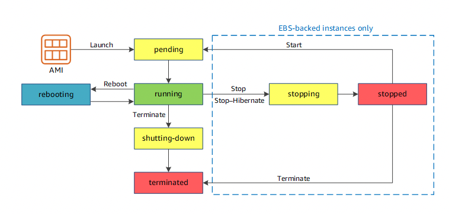
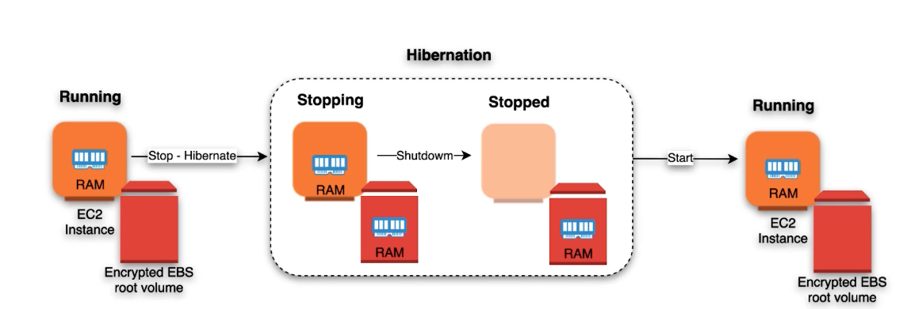

# EC2 instnace lifecycle
AWS ec2 instances have different lifecycles.

## States
- pending: Instance is in pendign mode when instance is started for the first time.
or being started after being stopped. Instance is not billed in this state.
- running: instance is ready to use in this state and is being billed according yo billing type for instance.
- stopping: instance is being stopped or stop-hibernated. not billed if stopping, billed if hibernating.
- stopped: instance is shut down and not billed. Instance cna be restarted any time. not billed.
- shutting down: The instance is preparing to be terminated. not billed.
- terminated: Instance has been permanently deleted and can not be started. not billed usually but Reserved Instances that applied to terminated instances are billed until the end of their term according to their payment option.

## Instance launch
When you create an instance and launc it it enters pending state, after instance is ready it enters running state and becomes billing.

## Instance start and stop
Instance stop is only available in ec2 instnaces with EBS backed storage and not for isntance level storage backed.
After initiating stopping of ebs backed ec2 instance it enters stopping state and after it stops ( both of these states are non billable )
Of course aws doesn't charge for stopped instance but it will charge of EBS that is attached to ec2 instance since it is taking space and resources for persistnt storage.
When you start instance after stopping it re enters pending state and ec2 may be moved to new host computer or may stay on the same one.
Instance retains ipv4 private address which also means that If you have elastic IP associated with ec2 instance it will still be available after stop/run.

## Hibernate
Hibernation is the same as stopping but with one major difference. During the hibernation process RAM state is snapshotted and persisted to the disk
and during the simple stopping ram is cleared and os is shut down. So after hibernation you can restore state of machine and it's processes in the
same state as it was before turning it off. And simple stopping of the instance doesn't let users do it.
You have to enable hibernation before you launch your instance not later and it doesn't
come as default feature with ec2. You can enable it from console too. YOu should enable it as a another stop behaviour.
When creating an instance with hibernate mode enabled, you must think well about size of EBS storage since during hibernation you will need enough storage to store FULL capacity of RAM into storage along with all the data that is persisted there.
During hibernation instance moves to stopping and stopped states.
To use hibernation ebs volume must be encrypted.

