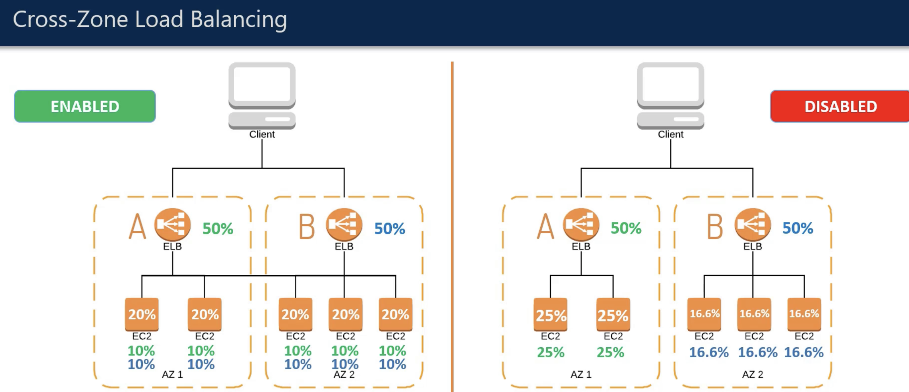

# Elastic load balancer
Elastic load balancer is a scalable mechanism that automatically balances traffic according to some chosne algorithm between several targets, these
targets mght be ec2 instances, containers and ip addresses. ELB monitors health of targets associated with it and sends traffic to only healthy targets.
"Elastic" in ELB means that this service is automatically scalable which means that it automatically scales in case of increased traffic. 
ELB solves issue of singel point of failure on multiple levels.
ELB supports Hybrid load balancing which enables to load balance between aws and on premise datacenter to have cloud infrastructure of a system as a
failover for systems on on-premise datacenters.

## Benefits
Main idea for a aload balancer is to distribute traffic between fully independent peaces of logic executors ( like services on ec2 instance or etc ) and get
high availability, which means that in case of one executor failing we still have second one which is ready to work.
You can add/remove resources and targets behind the load balancer without end users ever knowing it.
Healthchecks is also very beneficial from load balancers since it helps us reach resilliency.

## How does it work?
A load balancer gets incoming traffic to it and according to some algorithm/mechanism distributes it to specified targets.
You configure ELB to accept incoming traffic by specifying one or more listeners to it.
These listeners are configured as for protocol and port for client --> ELB as with protocol and port for ELB --> target.

For classic load balancers you simply add disctinct resources like instances and etc. With application, network, gateway laod balancers you register targets int target groups and route
traffic to target groups from elb.

## Availability zones and ELB
To use elb you must create it in a specific AZ. When you enable AZ for ELB, load balancing creates a ELB node in that AZ. If you register targets in specific AZ
but forget to enable this AZ for load balancing, no traffic will be routed to targets. 
AWS generally suggests to use multi AZ load balancers but specifically for application load balancers it is mandatory to use at least 2 AZ load balancer so that
traffic continues to be sent and system continues to work upon failure of one of them.
If you disable AZ for elb targets and resources registered in that AZ still remain there but traffic won't be routed to them.

## Cross zone load balancing
The nodes for your load balancer distribute requests from clients to registered targets. When cross-zone load balancing is enabled, each load balancer node distributes traffic across the registered targets in all enabled Availability Zones. When cross-zone load balancing is disabled, each load balancer node distributes traffic only across the registered targets in its Availability Zone.

Cross zone load balancing is by default on for Application load balancer and by default off for network load balancer.

Diagram for cross zone load balancing

## Routing algorithms
- Application load balancers: Routes Http and Https level traffic. First evaluate listeners registered to understand which rules to apply. Select target from the target group associated. Usual algorithm for choosing
target from a target group is round robin. 
- Network load balancers: Routes TCP/ip level traffic, select target from target group using flow hash algorithm. algorithm is based on: protocol, soure ip and port, dest ip and port, tcp seq. num. after this
algorithm routes each tcp connection to target for it's lifetime.

## HTTP headers
application and classic load balancers add headers forwareded-to, forwarded-proto, forwarded-Port. 

## Health checks
When ELB notices unhealthy instance it just stops routing traffic to it, and then continues to periodically check for it's health. Whenevr resource comes back to life
ELB will include this resource in further output of routing algorithm.
