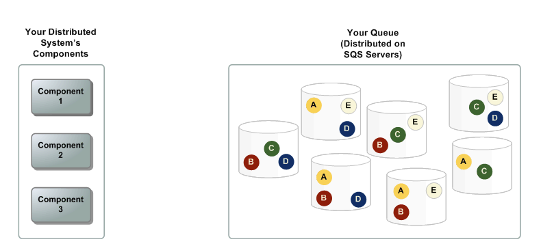
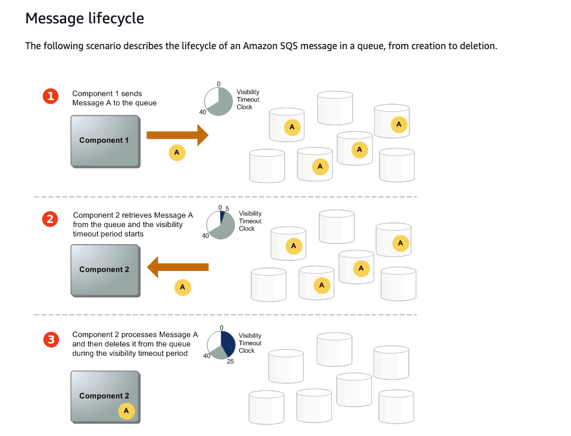

# AWS SQS
Simple Queue Service is a durable, highly available queing service offered by AWS that allow clients to decouple software systems and components via queues.
SQS supports both types of queues: standard anf FIFO which we'll discuss below in details.

## Benefits of SQS
- Security:specific IAM roles/users must be allowed to either emit or poll data into/from SQS. You can also encrypt data in transit on queue with KMS.
- Durability: data on SQS is durable and stored on multiple redundant servers. Standart queues support: at leat one delivery, FIFO queues support: exactly once delivery.
- Scalability: since AWS SQS is a managed service, it can scale in and out without any problems.

## Queue types
As we already mentioned there are mainly 2 types of queues:
- Standard queue
- FIFO queue

### Standard Queue
- Standard queues support nearlly unlimited number of API calls.
- At least once delivery is guaranteed. Actually occasionally more than one instance of a message is delievered in standard queues.
- Best effort ordering: messages sent might be reordered and delievered in a different order from when it was sent.
Mainly use Standard queue when recieving/reacting to messages is idempotent process, which means that process doesnt have problem to process message more than once.

### FIFO Queue
- High Throughput: max of 300 messages per second. with batching requests 3000 messages per second. In this type of queue messages arent duplicated and are recieved by destination processes
exactly once. Message sent stays in the queueing system until reciever explicitly notifies system that it got the message and no need to replicate it in the queue persistently any more.
- In FIFO queue ordering is guaranteed.
We should use FIFO queues in case where message delivery guarantee and topology and frequency is critical.
FIFO queues should be used in Financial and Retail services where order and exactly-once delivery is critical.

## Architecture
There are three important parts in distributed messaging systems:
- components of your distrbuted system ( client apps, producer/consumers of messages )
- Queue
- messages in queue

In this picture we can see illustration of a system like described above

Let's dig into the case when a message from let's say component 1 is sent to a component 2. And what's the messages lifecycle in this case.

## Long and short polling
As we know consumers of SQS messages aren't pushed from SQS with new messages. They must themselves poll for these messages.
These are two kinds of polling mechanisms in SQS API.
- Short polling: Check only some randomly distributed servers for new messages and return poll result.
- Long polling: Spend more time and check all the servers in distributed messaging system for new messages and return them.

