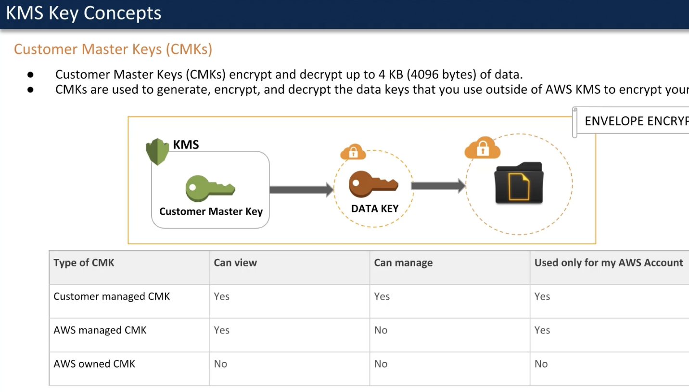
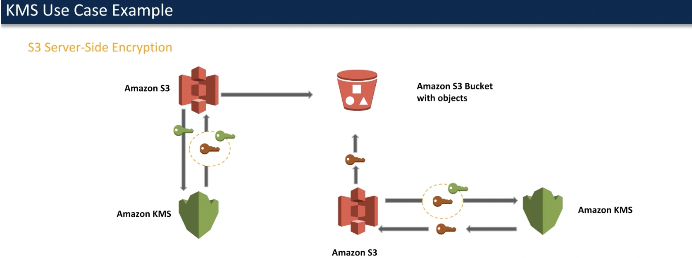

# Key management service
AWS provided service to create and manage keys used to encrypt data stored in different AWS storages.
AWS makes sure that keys aren't lost and they are always available.
One of the best points for usiing AWS KMS is that it's directly integrateble with all of AWS services and you won't have to manually manage all encyption related data.
AWS uses Hardware security model to secure your keys ( whatever it means ) except for China.

## KMS keys
main resource for AWS KMS. Mainly symmetric crypto keys but also can be assymetric one.
AWS customer master key-s are stored in default aws kms store in a shared environment. There might be a case that some complience policy
doesn't let you store keys in a shared env. so you need a dedicated secure/available one. For this you can use AWS CloudHSM clusters. 
These cluster are FIPS 140-2 level 3 which is higher than regular kms store.

## Customer master keys
CMK-s can only encrypt or decrypt up to 4kb ob data. The main usage for these CMK-s are to encrypt and safeguard actual data encryption keys. 
This way it comes up that you will have double encryption standard.
This double standard encryption is called as an Envelope encryption.

There are different types of CMK-s in context of management. Customer managed, AWS managed keys and AWS owned one.

## Data keys
Actual keys used to encrypt data. CMK-s are used to generate, encrypt and decrypt data keys.
KMS doesn't store data keys like it does CMK-s.

## Key policies
policies only for customer managed CMK-s.

## Grants
granting permissions to principals to get access to customer managed CMK-s.

## Use case with s3
The main idea is that since KMS stors only CMK-s and not data keys, data keys in an encrypted state are tored in s3 with actual data.
upon fetching, first encrypted data key will be decrypted using KMS CMK ( originally used to encrypt data key ), than normal state data key will be used to decrypt 
data in s3 itself. 

## CloudHsm
Hardware Module Security model for cluster which can be created in your vpc. and this so called secret vault will be only yours.

