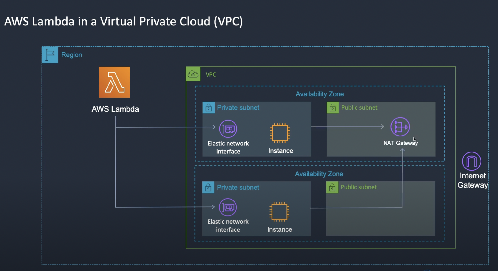

 AWS Lambda
- AWS lambda is aws-s compute service that lets you run code in cloud with 0 server provisioning.
- AWS lambda scales automatically, from few request per day to several thousand per second.
- Infrastructure is provisioned automatically.
- Lambda functions have their limits, at the moment for AWS lambda: max memory capaicity is: 3GB and max timeout for running code is: 15minutes
- Lambda is not a good fit for memory intensitve or long running applications.
- Client of aws lambda doesnt have to worry about high availability of aws lambda mechanisms since its provisined by aws.
- Since mostly Lambda functions interact and mutate state of other AWS resources client should assing correct IAM role to aws lambda for it to be able to access resources.
- You can ( not must ) choose VPC in which Lambda function should be run, and aws recommends to choose at least 2 subnets for your lambda function to be fault tolerant.
- If you choose no VPC for aws lambda, aws automatically manages networking properties for you lambda and by default it can access the internet.
- Max concurrent requests: 1000

## Lambda flow

## Lambda usecases

## Lambda foundational concepts  
- Function: Resource that you can invoke inside of lambda. Function processes events. 
- Trigger: Resource that runs specified function as a reaction to it's completion.
- Event: Json formatted data which has all metadata and data about trigger that caused specified lambda to invoke.
- Execution environment: provides isolated and secured env to run your lambda function.
- Instruction set arch: Determines processor architecture that will be used to run your code: arm64, x86_64
- Deployment package: You can deploy code to run into lambda using .zip files ( code + it's dependencies ) or container images.
- Runtime: language specific os level dependencies that make up whole runtime environment.
- Lambda layer: is a .zip archive that can contain additional code dependencies for main code to run.  A layer can contain libraries, a custom runtime, data, or configuration files. 
Layers provide a convenient way to package libraries and other dependencies that you can use with your Lambda functions. Using layers reduces the size of uploaded deployment archives and makes it faster to deploy your code. Layers also promote code sharing and separation of responsibilities so that you can iterate faster on writing business logic.
You can include up to 5 layers, and each layer will be unziped and contents placed in /oprt directory.....

## Lambda Features
- Scaling: Lambda manages infrastructure that under the hood of AWS lambda service runs your code. Lambda scales automatically depending on frequency of
incoming requests. Broad logic is next: When your lambda invokes functiion with a higher frequency per unit of time than this function can be executed it means that
someone is definetly waiting in queue, so we need to scale up. 
- Concurrency Control: Concurrency settings ensure high responsiveness for you apps, you can choose either Reserved concurrency option for lambda function not to
overdo and use all the resources. Reserved concurrency splits pool of resources into subsets and uses only its own subset of resources.
You can also use Provisioned concurrency with AWS lambda, in this concurrency property instnaces are pre initialized by aws and no time will be waisted when traffic increases
and several new instnaces need to be initialized with contextual data from speecific function to run.
- Sync vs Async invocation: you can invoke lambda function using sync or async execution. 

## Lambda programming model
Programming model of lambda is to provide some kind of interface between your code and machine, the interface is that you implement method in any language you want with
specific signature ( getting events and context ) and use there arguments to communicate with contextual data for lambda. 
When the handler finishes processing one invocation of the lambda function, whole function's outside contextual code stays in memory so you can reuse variables create counter
and etc.

## CPU architectures 
AWS lambda supports x86_64 and arm64 architectures. ARM ones provide better performace/price ration and it might be agood idea to use it.

## AWS lambda networking
Each running aws lambda function must reside in a VPC to be able to communicate with other aws resources and etc.
Lambda provides managed resources named Hyperplane ENIs, which your Lambda function uses to connect from the Lambda VPC to an ENI (Elastic network interface) in your account VPC.

By default aws lambda function runs in it's own vpc not connected to yours, it is also connected to internet by default in this default vpc.
If lambda is connected to your vpc, it follows all the rules provided by your vpc. For example: if there is no public subnet there lambda function won't be able to connect to internet.

When you create a Lambda function (or update its VPC settings), Lambda allocates a Hyperplane ENI for each subnet in your function's VPC configuration. Multiple Lambda functions can share a network interface, if the functions share the same subnet and security group.

To connect to another AWS service, you can use VPC endpoints for private communications between your VPC and supported AWS services. An alternative approach is to use a NAT gateway to route outbound traffic to another AWS service.

To give your function access to the internet, route outbound traffic to a NAT gateway in a public subnet. The NAT gateway has a public IP address and can connect to the internet through the VPC's internet gateway.

Its important to remember that to create ENI-s in a vpc-s subnet aws lambda must have according roles permitting these stuff.

## Concurrency
AWS lambda functions' concurrency is the number of instances that serve requests at a given time.
When requests come in faster than your function can scale, or when your function is at maximum concurrency, additional requests fail with a throttling error (429 status code).

