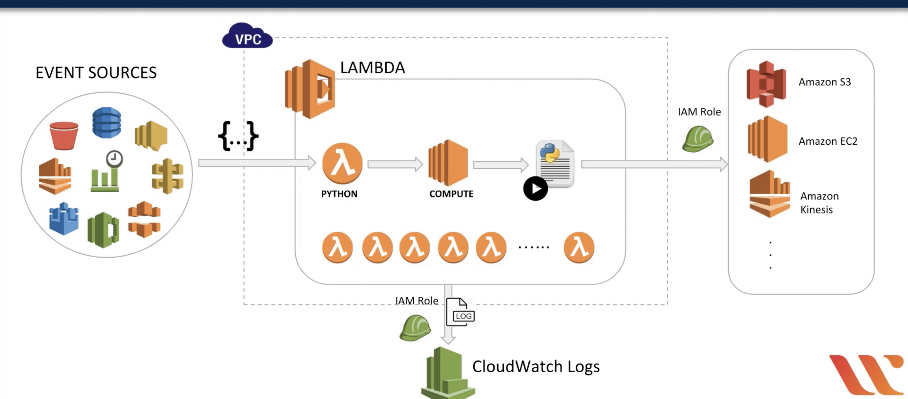
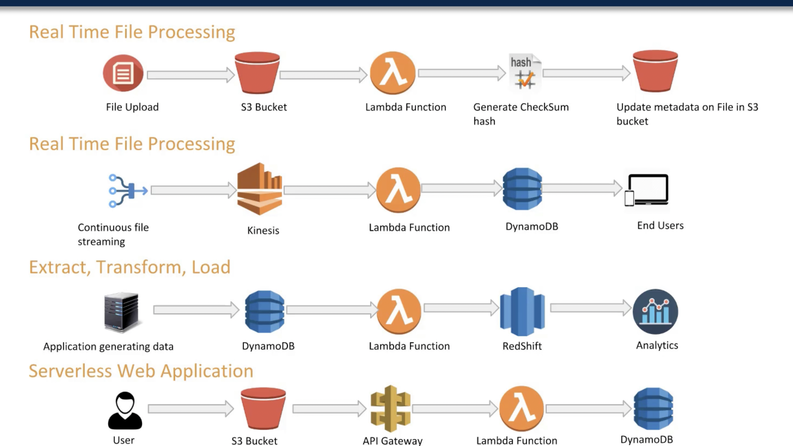

# AWS Lambda
AWS lambda is aws-s compute service that lets you run code in cloud with 0 server provisioning.
AWS lambda scales automatically, from few request per day to several thousand per second.
Infrastructure is provisioned automatically.
Lambda functions have their limits, at the moment for AWS lambda: max memory capaicity is: 3GB and max timeout for running code is: 15minutes
Lambda is not a good fit for memory intensitve or long running applications.
Client of aws lambda doesnt have to worry about high availability of aws lambda mechanisms since its provisined by aws.
Since mostly Lambda functions interact and mutate state of other AWS resources client should assing correct IAM role to aws lambda for it to be able to access resources.
You can ( not must ) choose VPC in which Lambda function should be run, and aws recommends to choose at least 2 subnets for your lambda function to be fault tolerant.
If you choose no VPC for aws lambda, aws automatically manages networking properties for you lambda and by default it can access the internet.
Max concurrent requests: 1000

## Lambda flow

## Lambda usecases

