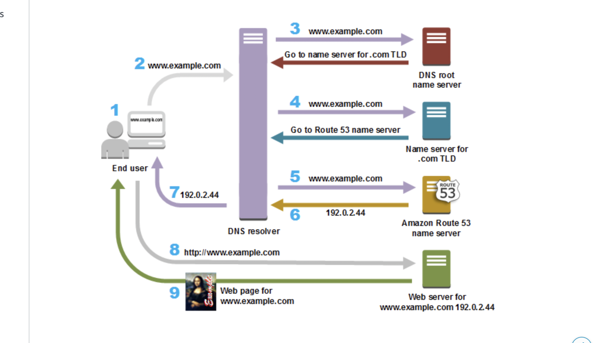

# AWS Route53 dns
Route53 is DNS service. AS you know internet is simply a interconnected nodes of many computers, when one machine wants to talk to another one it should get it's name, how to 
call him, just like in real life situation, you must know a persons name if you want to have a good chat with them.
Machines don't have names like humans do, but they have ip addresses 4 8byte expression from 0-255 that uniquely identify machines. Of course we are humans and we aint as good with
numbers as machines are, so we dont want to remember ip address of google.com lets say, so we create DNS-s servers specialized in translating IP addresses into names and vice versa.

## Route53 features
- Register domain names
- Route internet traffic for your domain
- Healthchecks of your service registered in domain registries

## Concepts in Route53
- Domain name: Human readable mapping to ip address.
- Top level domain server: servers that have records for routing .com, .org, .net and etc domain mappings.
- Subdomain: maps.google.com is subdomain fo google.com. Main host is same, main domain name is same but there is preappendend some more data.
- Domain registrar: Company accredited by ICANN to process domain registrations for TLD servers. for AWS it's AWS and Gandi.
- Domain registry: a company who can sell tld domain names, like go daddy?
- Name servers: servers in dns system that themselves translate and store ip <--> domain name mapping themselves.

## Whole process of using route53
- If you want to create a web application you must have a domain name for it. You must choose a unique/available domain name to register it in route53.
If the domain is already taken you can try changing the top level domain like .com to .org .ninja or etc.
- When you register a domain in route53 the service automatically makes itself the DNS service for the domain:
	- Creates a hosted zone that has the same name as your domain
	- Assings a set of 4 name servers, all located in unique stripes ( unique TLD-s )
	- ..
- At the end of registration AWS sends your info to Domain Rregistrat ( It's AWS itself or Gandi )
- Registrar sends your info to registry for the domain. A registry is a company that sells domain registration for one or more TLD-s such as .com.
- The registry stores the information about your domain in their own database and also stores some of the information in the public WHOIS database.

## Hosted zones
There are private and public hosted zones, public obviously is for public DNS features, when you want for users from public internet to get to your servers let's say. Private is for internal VPC use. 
when you create your public hosted zones and you want to host it on route53 ( this autmoatically gets created when you create new domain name with correct config) route53 will automatically allocate 4 name servers to be responsible for your records. These are the 4 authoritative name servers that know data about
records you add. If you see TLD endings for these name servers you'll see that they are all for different TLD-s ( like .net, .com, .org ..etc )
They are called stripes and they are all independent. So when you want to create hosted zone for some domain some available name servers from these
stripes will be allocated to your needs.

## SLA
Route53 guarantees 100 percent SLA, which means that all the queries sent to route53 will be answered all the time.

## Basic diagram of route 53 

As we see from the diagram, all the main heavy lifting job is done by a DNS resolver server, which is provided mainly by ISP-s
