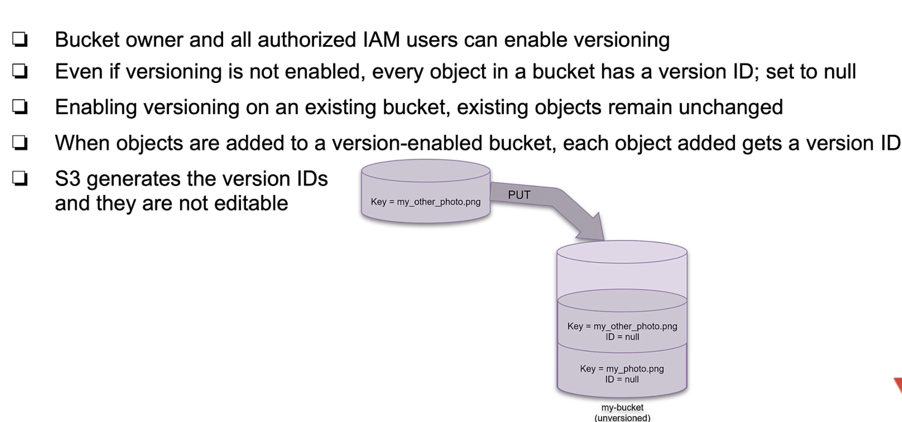

# Simple Storage Service
AWS s3 is an object storage service that offers scalable, highly avaiable store for any kind of data.

## Storage classes
- S3 Standard, general purpose - is used in most of the use cases, it offers high availability, durability, low latency for retrievals and etc.
This is the most widely used configuration class for s3. Offers nine 9-s SLA.
- AWS S3 Intelligent Tiering - storage class that automatically decides most useful and propper class of aws s3 storage and moves your data there.
Decision of moving data is always depnded on it being most cost effective, and all this ceremonial of updating storage class used is without any additional charges.
This mechanism with cost also looks at frequency of access and using these results decides whether to move them to lower freq. access tiers or move upwawrds.
- S3 standart Infrequent access - low cost ( by infrequest access ) and high speed of access whenever needed. This mechanism is also replicated and highlt available. 
- S3 one zone infrequent access - same as above but not highly avaiable, you can save this class which uses only 1 AZ, by compromising avaiablitiy you can save
funds. Of course this class should be used only if data stored there is not mission critical.
- S3 glacier classes are used for archiving data. Data which will be needed very very infrequently. Here are also types when glacier data whenever accessed
will need instant access or will not care about it and etc.

Each storage classes provide Min. storage duration tht must be comited by the client:
- standard: 
- intelligent tiering, standard IA and one zone IA is: 30 days.
- Glacier: 90 days
- Glacier Deep archive: 180 days.

## Buckets and Objects
The abstractions that you work with in S3 storage are called buckets and objects. Relation between them is that you store as many objects you want in a bucket.
AWS s3 bucket name must be globally unique. You must specify a region that AWS s3 bucket will use upon creation.

#### Security of s3 buckets
All kind of access for s3 buckets are controlled over ACL-s, bucket policies or both. For ease of use aws s3 provides capability to block all public access to s3.
Public access blocking mechanism can override acl-s and policies. 

#### Bucket configurations
AWS allows you to configure tons of properties for s3 buckets manually like:
- CORS policy: if we want to access one s3 bucket from static web site hosted on another s3 bucket.
- Event notifications
- lifecycle: rules that react to some lifecycle callback. 
- Versioning helps you recover accidental overwrites and deletes.We recommend versioning as a best practice to recover objects from being deleted or overwritten by mistake.
- Encryption: You can encrypt using s3 manageed key SSE-S3 or your own key from aws KMS

## Versioning
Versioning is the mechanism for objects in s3 buckets using which you can store several versions of the same object in S3.
You can manipulate, fetch and use every version of every object in your s3 bucket. Multiple versions can be used very richly since you can solve
issues caused by accidental corruptions or deletions of files, since you can use earlier versions. for versioning unique ID-s are generated for each object.

It's important to understand that versioning is bucket level policy and not whole s3 service or individual object level.
Only bucket owner and other IAM accessable roles can enable versioning for the bucket.

Bucket states when using versioning:
- unversioned
- versioning-enabled
- versioning-suspended
 
If you dont enable versioning by default s3 bucket is in unversioned state. If you once enable versioning for a bucket it transitions to versioning enabled state and
you can't move this bucket to unversioned state ever. You are just able to put it into versioning-suspended state which is equivalent of pausing versioning mechanism for s3 bucket.

### Diagram for visualizing specifics of unversioned bucket.

### Diagram for visualizing specifics of versioned bucket.

### Deleting an object from versioning enabled bucket
Versioned s3 bucket doesn't delete objects from the bucket. It just marks records as deleted like in the diagram

After deletion if you try to get latest version of the object you will get 404 error since latest one is marked with a deletion marker.
You can also retrieve other versions ( not latest ) by specifying version ID when you try to fetch.

Only bucket owner can permanently delete record with a specific version ID. This mechanism doesn't set delete marker but rather literally deletes the record with specified version.

S3 versioning might create performance problems. If some objects in a bucket gets to too big of ID numbers. 
## Multi factor auth delete
You can enable it. ( maybe when data stored in s3 is literally mission critical )

