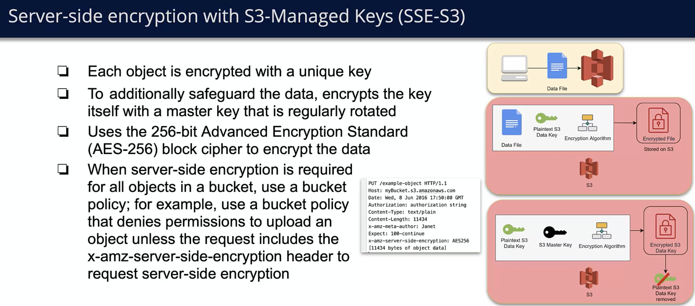
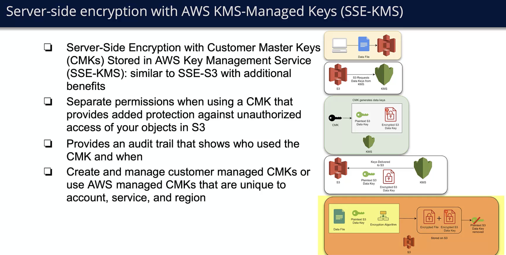
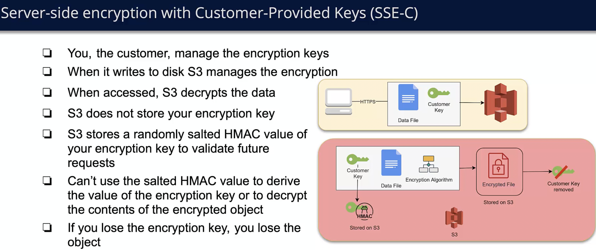

# Security
Securing data stored in S3 buckets is a crucial task.
There are 2 types of envryptions you can use to secure data in s3:
- server side encryption
- client side encryption

One common practice is to ensure that all objets uploaded to s3 are encrypted is to add bucket policies that will deny upload request if no x-amz-server-side-encryption is specified.

## Server side Encryption
Server side encryption is the encyption of data on the server, when data is recieved and before it's stored and decrypt when fetching data from bucket. When using server side encryption application level API
stays exactly the same as it is with no encryption, since encryption/decyption process is abstracted under s3 api.
There are 3 mutually exclusive options for managing keys with server side encryption:
- Server-Side Encryption with Amazon S3-Managed Keys (SSE-S3). In this case s3 manages keys itself, and each object is encrypted with unique key, and for extra safety these keys are alsoencrypted iwht a root key.
Algorithm used is AES-256 which is one of the strongest encryption algorithms.

General flow and mechanism for SSE-S3

- Server-Side Encryption with KMS stored aws key (SSE-KMS). This is mainly the same as SSE-S3 just instead of S3 managing keys intrinsically now we manually manage aws keys using aws KMS service. 
This is associated with additional costs since we are using additional aws service but it also comes with additional benefits, like you can see logs of who used which key in history.  

General flow and mechanism for SSE-KMS

- Server-Side Encryption with Customer-Provided Key (SSE-C): In this case you yourself manage keys outside of aws.
In this usecase, if you looose your key you loose your object since you won't be able to decrypt it.

General flow and mechanism for SSE-C

## Client side encryption
9 times out of 10 client side encryption with master key stored in KMS is the correct usage.
