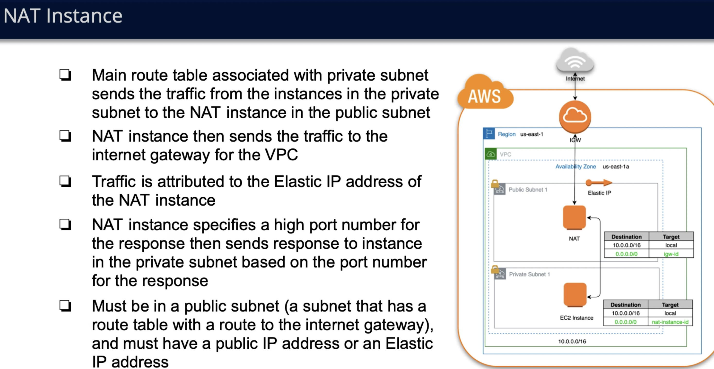
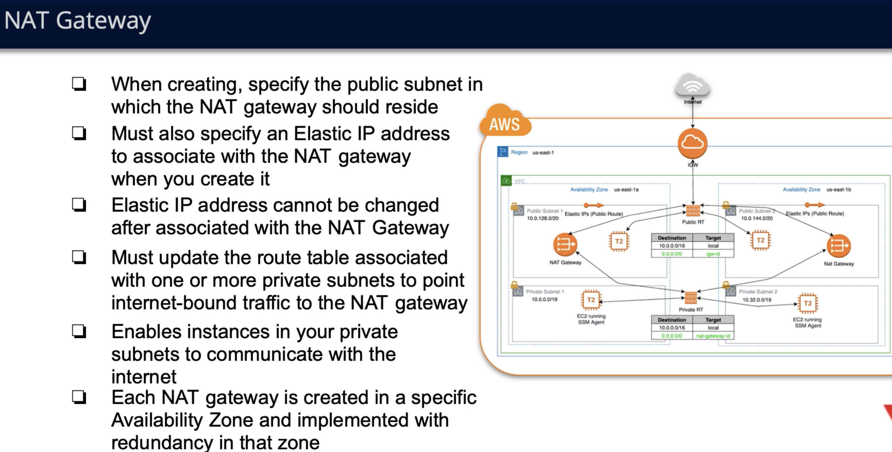

# NAT devices in aws
- Main usage of NAT is to help resources in private subnet connect to internet safely.
- Prevents packets from internet to flow and initiate connection with resources in private subnet
- Coordinates request response pairs from private subnets resources and internet, so that internet sees that NAT asks for data from internet
and doesn't know anything about instances in private subnet.
- IPv6 doesn't work with NAT gateway

## AWS NAT implementations
AWS currently has 2 implementations of NAT mechanism: 1)NAT gateway and 2)NAT instance
Even though Nat instances are kind of deprecated there might be usages seen.

## Differences between NAT gateway and NAT instance
NAT gateway is complete service/resource managed and offered by AWS which means that all the implementation details and configurations/provisioning
of it working correctly is on AWS-s side. But for NAT instance, it's simply an ec2 instance with NAT features, so you are in charge of configuring and making
sure it works correctly.

Feature comparisons for NAT gateway and NAT instance
#### Availability
- NAT gateway - since it's AWS managed resource, it has built in, preconfigured redundancy but only in availability zone. If you want to achieve high availability
in multi availaiblty zone context you'll need to create NAT gateway in separate AZ-s.
- NAT instance - no preconfigured redundnacy/high availability at all. Needs to be configured manually via running several backup instances ..etc.

#### Bandwidth
- NAT gateway - can scale up to 45 Gbps, is dynamic.
- NAT instance - you should pick ec2 instance yourself, so it depends on ec2 instance type you choose.

#### Maintenence
- NAT gateway -  Managed by AWS.
- NAT instance - manual management, os updates, patches..etc.

#### Performance
- NAT gateway - generally behaves better for NAT-ing since this mechanism is optimized only for this problem.
- NAT instance - is kinda general mechanism not optimized for NAT-ing, its just ec2 configured with nat capabilites.

#### Cost
- NAT gateway - M * Number of NAT gateways used + N * period of time NAT gateway is up and running + K * amount of data flowing through it. Where M, N, K are some numbers.
- NAT instance - same as NAT gateway + price for type of ec2 instance you use.

#### Public IP address
- NAT gateway - specifying elastic IP to associate with this NAT gateway only at creation time
- NAT instance - same as NAT gateway-s, also can change and associate new Elastic IP at any time since it's basic ec2 instance.
 
#### Private Ip address
- NAT gateway - automatically chosen from subnet's ip range
- NAT instance - you choose by hand pricate ip address for an instance.

#### Security groups
- NAT Gateway - can't associate directly to NAT gateway but can associate with resources behind NAT gateway such as ec2 instances and etc.
- NAT instance - can associate to NAT instnace since it's basic ec2 instance and it has configurable ENI

#### NACL, Flow logs
- for both NACL can be configured to control traffic of subnets where any of NAT-s mechanisms reside.

#### Port forwarding
- Gateway cant support port forwarding and instance can
#### Bastion servers
- Gateway cant support bastion server mechanism but instance can

#### Timeout behaviour
- Gateway sends RST packet on timeout of connection and not FIN
- Instance send Fin packet on timeout

## NAT instance diagram example

## Multi availability zones NAT Gateway

