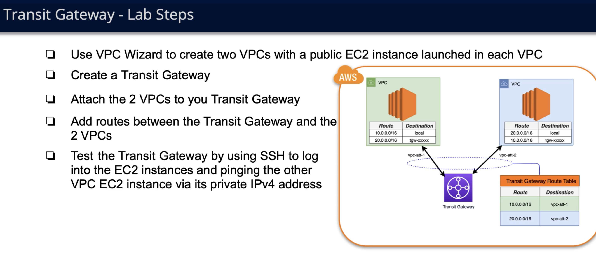

# Transit gateway
TransitGateway is mainly used hub to interconnect VPC-s and on premise networks.
Transit Gateway is a service inside of VPC which has it's own route table. Since it's located inside of vpc we can configure specific VPC-s route table
to direct traffic from specific route to instance of transit gateway.

if resources in each separate vpc have public elastic ip we can anyways ping and communicate through different resources on different vpc-s via igw and internet.
But the real use case of transit gateway comes up whne we want to let's say ping private ip address of one ec2 instance in vpc1 from another ec2 from vpc2 without
using public internet at all.

### Terms: 
- Attachment: each VPC-s subnets grouped in one entity which for transit gateway identify one entity to route to. After creating transit gateway you can attach
attachments, attachments must be subnets from already existent VPC which we want to take part in cross VPC routing. For DNS support, select this option if you
 need the VPC to resolve public IPv4 DNS host names to private IPv4 addresses when queried from instances in another VPC attached to the transit gateway. 
- Transit gateway route table: route table of transit gateway where explicit connection  between vpc-s must be specified.

As already stated Transit gateway also has route table in it, which has rules for traffics from which routes to direct to which vpc ( usually logical case will be
to direct traffic from vpc1 to vpc2 and vice versa ). So we add route record as Destination: ANOTHER_VPC_CIDR, target: vpc_id 

Since we need to be able to use Transit gateway from each VPC, we need to modify route tables of selected subnets as attachments and add there for which route
( usually same route CIDR to which vpc we want to route ) we want traffic to be fotwarded to transit gateway. so we add in route table of each vpc:
Destination: CIDR_OF_ANOTHER_VPC_WE_WANT_TO_CONNECT_TO, Targeet: ID_OF_TRANSIT_GATEWAY

### Example
Diagram of transit gateway usage for connecting and pinging private ip addresses of ec2 instances in seperate vpc-s

