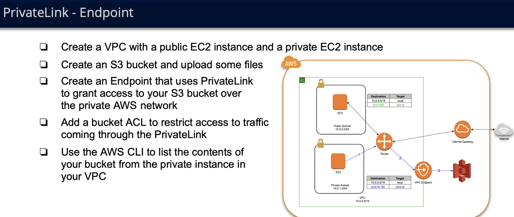

# Vpc Endpoints
Often when writing systems in aws there is need for system in different VPC-s to talk each other. Of course there are several ways
of settings up this connection: like internet, vpn...etc. But They are all not fully secured. This is were VPC privatelink and vpc endpoints come in.

## VPC PrivateLink service
PrivateLink service is used by application makers who want their app in their VPC to be accesible from other VPC-s. So basically service providers
setup PrivateLink on their VPC.

## VPC endpoint interface
VPC endpoint interface is used by service consumer vpc-s to connect to other VPC-s endpoints exposed by PrivateLink.

## Practical example
Let's go through next example as in diagram below. Its often the case that we have ec2 instance or some other resource in private subnet and it needs to access
some AWS-s service which isn't specifically located in vpc like S3 buckets. For security purposes we don't want instance in private subnet to access S3 through 
public internet, For this exact case we can use VPC endpoints. We create VPC endpoint associate associate it with external AWS service ( which we want to access )
and associate it with route table ( for this case let's say we have separate route table for private subnet where private ec2 instance resides ). This associations
automatically modify specified route table and add record with destination: S3 ( aws external resource that we have chosen ) and target as vpc endpoint just created.
This route coniguration for a subnet means to forward all packets destined for S3 bucket ( aws external resource ) to VPCE which know how to connect to S3 securely. 

After this setup we'll also need to configure access to s3 and add to it's access policies rule that only traffic from vpce be allowed.

### Diagram

#### Note
This above problem of: ec2 instance in private subnet not being able to connect to let's say s3 service might have been solved with putting NAT gateway in
public subnet, routing outgoing packets internet via NAT and getting S3 data via public internet. But this has several draw backs: 1) NAT is not free and VPCE is.
2) VPCE has more control over who can access and what, since for it we also restrict access to S3 to only traffic from VPCE and it would have been more work and
configuration to specifically restrict s3 to some traffic from public internet.

